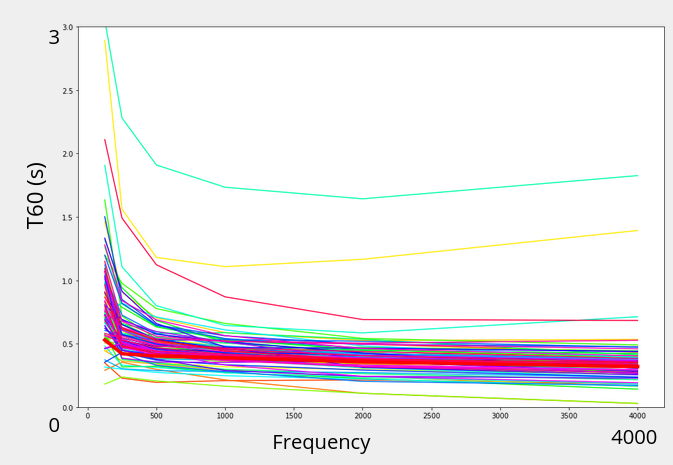

# Room acoustics characterization
> This project contains a whole research pipeline on room acoustics characterization using neural networks. 

## Table of contents
* [General info](#general-info)
* [Screenshots](#screenshots)
* [Technologies](#technologies)
* [Setup](#setup)
* [Features](#features)
* [Status](#status)
* [Inspiration](#inspiration)
* [Contact](#contact)

## General info
The acoustical character of a room is important in many situations that we often do not pay attention to. Acoustic properties are however an important aspect of room design. They are closely related to speech intelligibility and music reproduction quality in an enclosed space. 

Logitech's Ultimate Ears brand develop portable speakers. Such devices are made to be used in many different environments such as indoor or outdoor, or in different sized rooms that might have not been optimized for sound quality. Thus, Designing versatile speakers with the goal of having the best possible sound reproduction involves taking room acoustic parameters into consideration. 

Each room has its own signature that correspond to its response to an excitation over every frequency. This is called the room impulse response. It is due to the reverberation of the sound on the walls and the absorption due to the materials and objects of a room. In consequence, any played sound or spoken sentence in a room will be subject to modulations.

Unconsciously, humans and other forms of life sense these modulations and process them such that we are able to abstract those parameters and use them to stay balanced and, even with closed eyes, are able to stand still and know in which room they are. 

A simple illustration of that is when you hear someone on the phone and he is in his bathroom. A bathroom is usually a very reverberant environment when made out of hard tiles that reflect sound with almost no absorption. If no de-reverberation processing is applied to the sound, your interlocutor will be hard to understand as his speech will be very reverberant. 

This repository contains machine learning based methods to teach such faculties to a portable loudspeaker equipped with a microphone.


## Screenshots


## Technologies
* python - version 3.7
* tensorflow-gpu - version 2.1
* librosa - version 0.7.2
* scipy - version 1.4.1
* sox - version 1.3.7
* cudnn - version 7.6.5 
* cuda - version 10.1_0

## Setup

```console
git clone https://github.com/polocallens/room-acoustics-characterization
cd room-acoustics-characterization
conda env create -f environment.yml
```

## Usage
### Getting dataset
- RIR dataset
```console
wget 
```
- music dataset
```console
wget 
```

- speech dataset
```console
wget 
```

### Prepare dataset
- 1. From data to network input
Trim, resample, normalize audio, convolve to simulate room reverberation and compute mfccs


### Training

* 1. 

* Awesome feature 1


## Features

* Awesome feature 1
* Awesome feature 2
* Awesome feature 3

To-do list:
* Wow improvement to be done 1
* Wow improvement to be done 2

## Status
Project is: _in progress_,

## Inspiration
Add here credits. 
Project inspired by..., based on...

## Contact
Created by [@polocallens](contact@paulcallens.com) - feel free to contact me!
[Paul Callens](mailto:contact@paulcallens.com?subject=[GitHub]%20Room%20characterization%20project)


## Instructions

You will need :
- RIR directory --> rirDir
- Music or speech directory --> musicDir 

## Datasets
#### RIR


### Convolve music dataset with RIRs

```console
python convolute.py
```
#### Arguments 

| Name       | Type   | Default                            | Description                      |
| ---------- | ------ | ---------------------------------- | -------------------------------- |
| `audioDir` | path   | [Timestamp(begin), Timestamp(end)] | Array of start date and end date |
| `dateEdit` | single | Timestamp                          | Selected date Timestamp          |


# Arguments and Usage
## Usage
```
usage: argdown [-h] -audioDir AUDIODIR -rirDir RIRDIR -outDir OUTDIR -trim
               TRIM [-outFormat OUTFORMAT]
```
## Arguments
### Quick reference table
|Short       |Long         |Default|Description                       |
|------------|-------------|-------|----------------------------------|
|`-h`        |`--help`     |       |show this help message and exit   |
|`-audioDir` |`--audioDir` |`None` |Music directory.                  |
|`-rirDir`   |`--rirDir`   |`None` |rir directory                     |
|`-outDir`   |`--outDir`   |`None` |output directory                  |
|`-trim`     |`--trim`     |`None` |Audio length in seconds           |
|`-outFormat`|`--outFormat`|`mfcc` |Output format --> mfcc or wavfile |

### `-h`, `--help`
show this help message and exit

### `-audioDir`, `--audioDir` (Default: None)
Music directory.

### `-rirDir`, `--rirDir` (Default: None)
rir directory

### `-outDir`, `--outDir` (Default: None)
output directory

### `-trim`, `--trim` (Default: None)
Audio length in seconds

### `-outFormat`, `--outFormat` (Default: mfcc)
Output format --> mfcc or wavfile


### Analyse RIR dataset 
To generate the true t60, c50, c80 and drr values from your RI dataset, run :
```console
python acoustic_param_ds_maker.py -rirDir YOUR_RIR_DIR/ -outDir WHERE_YOU_WANT_YOUR_TRUE_VALUES
```
It will create subdirectories for each parameter and pickle files with the name from the original rir.


