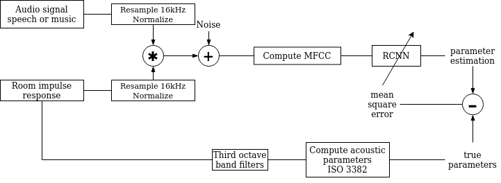

# Room acoustics characterization
> This project contains a whole research pipeline on room acoustics characterization using neural networks. 

## Table of contents
* [General info](#general-info)
* [Method](#method)
* [Technologies](#technologies)
* [Setup](#setup)
* [Usage](#usage)
* [Example](#example)
* [Contact](#contact)

## General info
The acoustical character of a room is important in many situations that we often do not pay attention to. Acoustic properties are however an important aspect of room design. They are closely related to speech intelligibility and music reproduction quality in an enclosed space. 

Logitech's Ultimate Ears brand develop portable speakers. Such devices are made to be used in many different environments such as indoor or outdoor, or in different sized rooms that might have not been optimized for sound quality. Thus, Designing versatile speakers with the goal of having the best possible sound reproduction involves taking room acoustic parameters into consideration. 

Each room has its own signature that correspond to its response to an excitation over every frequency. This is called the room impulse response. It is due to the reverberation of the sound on the walls and the absorption due to the materials and objects of a room. In consequence, any played sound or spoken sentence in a room will be subject to modulations.

Unconsciously, humans and other forms of life sense these modulations and process them such that we are able to abstract those parameters and use them to stay balanced and, even with closed eyes, are able to stand still and know in which room they are. 

A simple illustration of that is when you hear someone on the phone and he is in his bathroom. A bathroom is usually a very reverberant environment when made out of hard tiles that reflect sound with almost no absorption. If no de-reverberation processing is applied to the sound, your interlocutor will be hard to understand as his speech will be very reverberant. 

This repository contains machine learning based methods to teach such faculties to a portable loudspeaker equipped with a microphone.


## Method

Function block diagram of the method



## Technologies
* python - version 3.7
* tensorflow-gpu - version 2.1
* librosa - version 0.7.2
* scipy - version 1.4.1
* sox - version 1.3.7
* cudnn - version 7.6.5 
* cuda - version 10.1_0

## Setup

```console
git clone https://github.com/polocallens/room-acoustics-characterization
cd room-acoustics-characterization
conda env create -f environment.yml
```

## Usage
### Getting dataset

The train and test datasets as well as the weights can be found in the NAS in this directory:
[smb://ch01nas03.logitech.com/Development/Internships/2020\ Spring/Paul\ Callens\ -\ Room\ acoustic\ characterization/](smb://ch01nas03.logitech.com/Development/Internships/2020\ Spring/Paul\ Callens\ -\ Room\ acoustic\ characterization/)

### Prepare dataset
- 1. From data to network input
Trim, resample, normalize audio, convolve to simulate room reverberation and compute mfccs

```console
python convolute.py [-h] -audioDir AUDIODIR -rirDir RIRDIR -outDir OUTDIR -trim
               TRIM -outFormat OUTFORMAT [OUTFORMAT ...] [-noiseSNR NOISESNR]
               [-noiseType NOISETYPE] [-noiseFile NOISEFILE]
```

|Short       |Long         |Default|Description                                                                          |
|------------|-------------|-------|-------------------------------------------------------------------------------------|
|`-h`        |`--help`     |       |show this help message and exit                                                      |
|`-audioDir` |`--audioDir` |`None` |Music directory.                                                                     |
|`-rirDir`   |`--rirDir`   |`None` |rir directory                                                                        |
|`-outDir`   |`--outDir`   |`None` |output directory                                                                     |
|`-trim`     |`--trim`     |`None` |Audio length in seconds                                                              |
|`-outFormat`|`--outFormat`|`None` |output format (mfcc mel wavfile)                                                     |
|`-noiseSNR` |`--noiseSNR` |`None` |Add noise to rev signal at the specified SNR                                         |
|`-noiseType`|`--noiseType`|`white`|Type of noise --> white, random or real. if real, please specify file with noiseFile |
|`-noiseFile`|`--noiseFile`|`None` |Path to real noise file                                                              |


New audio and RIR directories will be created containing the re-sampled and trimmed wav files. 
Please use the new RIR directory to compute the true acoustic values in the following command. 
To add random noise, please specify -noiseSNR 0 and -noiseType random

- 2. Compute true acoustic values from normed rir directory

To generate the true t60, c50, c80 and drr values from your RI dataset, run :
```console
python acoustic_param_ds_maker.py [-h] -rirDir RIRDIR -outDir OUTDIR -params PARAMS [PARAMS ...]
               [-bands BANDS [BANDS ...]]
```

|Short    |Long      |Default                                        |Description                             |
|---------|----------|-----------------------------------------------|----------------------------------------|
|`-h`     |`--help`  |                                               |show this help message and exit         |
|`-rirDir`|`--rirDir`|`None`                                         |rir directory.                          |
|`-outDir`|`--outDir`|`None`                                         |output folder.                          |
|`-params`|`--params`|`None`                                         |parameters to be computed.              |
|`-bands` |`--bands` |`[125.0, 250.0, 500.0, 1000.0, 2000.0, 4000.0]`|center bands for parameters computations|

It will create subdirectories for each parameter and pickle files with the name from the original rir.

### Training

Once the preparation is done, you can start training your network with :

```console
python train.py [-h] -xDir XDIR -yDir YDIR [-outDir OUTDIR] -name NAME
               [-load_weights LOAD_WEIGHTS] [-n_epochs N_EPOCHS]
               [-window_size WINDOW_SIZE] [-mfcc_bands MFCC_BANDS]
               [-n_channels N_CHANNELS] [-output_size OUTPUT_SIZE]
               [-batch_size BATCH_SIZE] [-y_param Y_PARAM] [-net NET]
               [-lr LEARNING_RATE] [-gpu GPU]
```
|Short          |Long             |Default     |Description                                             |
|---------------|-----------------|------------|--------------------------------------------------------|
|`-h`           |`--help`         |            |show this help message and exit                         |
|`-xDir`        |`--xDir`         |`None`      |Mfcc data directory.                                    |
|`-yDir`        |`--yDir`         |`None`      |true acoustic values (from rir) directory.              |
|`-outDir`      |`--outDir`       |`trainings/`|output directory where to save logs and weights         |
|`-name`        |`--name`         |`None`      |Training label /!\ No space please.                     |
|`-load_weights`|`--load_weights` |`None`      |path to weights to load, default None does not load any.|
|`-n_epochs`    |`--n_epochs`     |`1000`      |Number of epochs before finish.                         |
|`-window_size` |`--window_size`  |`798`       |mfcc window size                                        |
|`-mfcc_bands`  |`--mfcc_bands`   |`40`        |Number of mfcc bands (along freq axis)                  |
|`-n_channels`  |`--n_channels`   |`1`         |Numbers of mfccs stacked for input                      |
|`-output_size` |`--output_size`  |`6`         |output shapes [number of freq bands]                    |
|`-batch_size`  |`--batch_size`   |`64`        |Network batch size                                      |
|`-y_param`     |`--y_param`      |`t60`       |Output to learn : t60, drr, c50, c80, all               |
|`-net`         |`--net`          |`CRNN2D_2`  |which neural net to train                               |
|`-lr`          |`--learning_rate`|`0.001`     |adam learning rate                                      |
|`-gpu`         |`--gpu`          |`1`         |gpu 0 or gpu 1                                          |


### Example
- 1. Simulate reverberation from audio and rir file:
```
python simulate_reverberation [-h] -audio AUDIO -rir RIR -trim TRIM [-noiseSNR NOISESNR]
               [-noiseType NOISETYPE] [-noiseFile NOISEFILE]
```
|Short       |Long         |Default|Description                                                                          |
|------------|-------------|-------|-------------------------------------------------------------------------------------|
|`-h`        |`--help`     |       |show this help message and exit                                                      |
|`-audio`    |`--audio`    |`None` |Audio file                                                                           |
|`-rir`      |`--rir`      |`None` |RIR file                                                                             |
|`-trim`     |`--trim`     |`None` |Audio length in seconds                                                              |
|`-noiseSNR` |`--noiseSNR` |`None` |Add noise to rev signal at the specified SNR                                         |
|`-noiseType`|`--noiseType`|`white`|Type of noise --> white or real. if real, please specify file with noiseFile argument|
|`-noiseFile`|`--noiseFile`|`None` |Path to real noise file                                                              |


- 2. Make predictions

```
python predict_params.py [-h] -revAudio REVAUDIO [-gpu GPU] [-param PARAM] [-rir RIR]
               [-model MODEL] -weights WEIGHTS
```

|Short      |Long        |Default              |Description                                    |
|-----------|------------|---------------------|-----------------------------------------------|
|`-h`       |`--help`    |                     |show this help message and exit                |
|`-revAudio`|`--revAudio`|`None`               |reverberant audio file.                        |
|`-gpu`     |`--gpu`     |`0`                  |GPU used for computation                       |
|`-param`   |`--param`   |`t60`                |Parameter to predict among t60,c50,c80,drr,all |
|`-rir`     |`--rir`     |`None`               |Specify rir to print true output               |
|`-model`   |`--model`   |`CRNN2D_largefilters`|Network to use for inference                   |
|`-weights` |`--weights` |`None`               |Load model weights                             |


## Contact
Created by [@polocallens](github.com/polocallens) - feel free to contact me!
[Paul Callens](mailto:contact@paulcallens.com?subject=[GitHub]%20Room%20characterization%20project)
